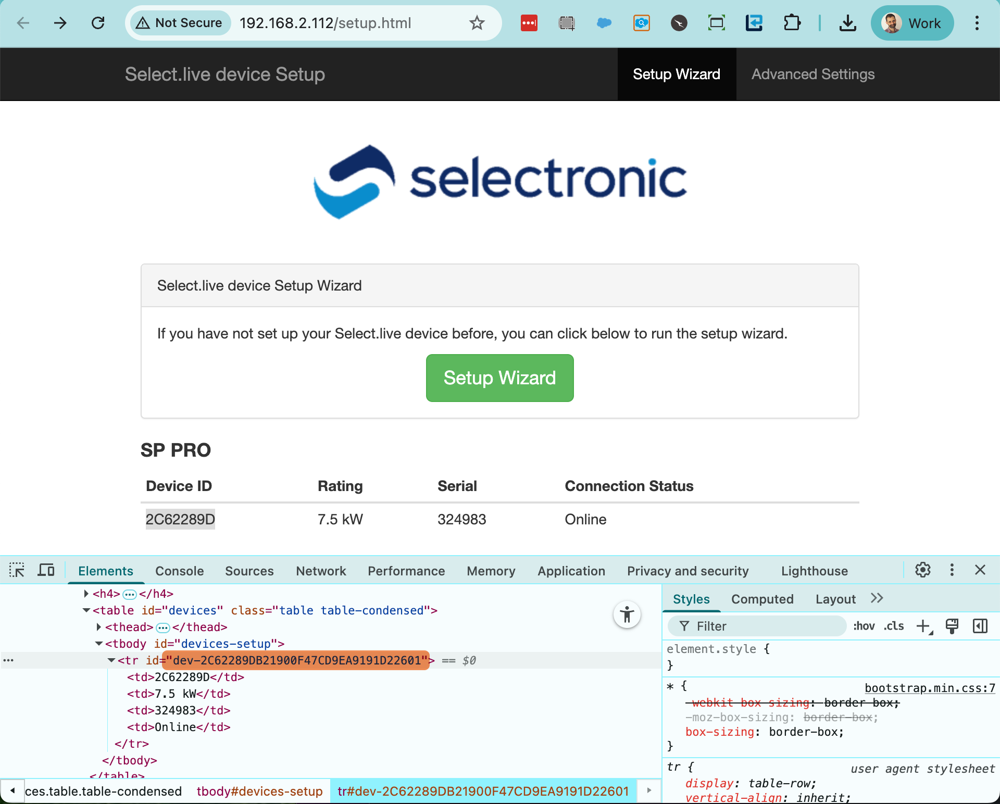
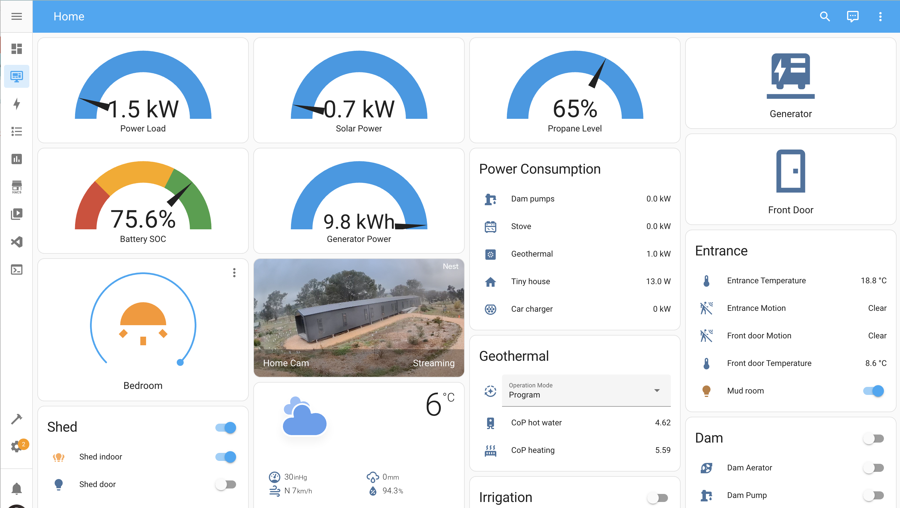
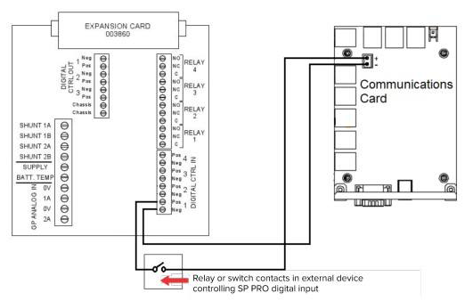
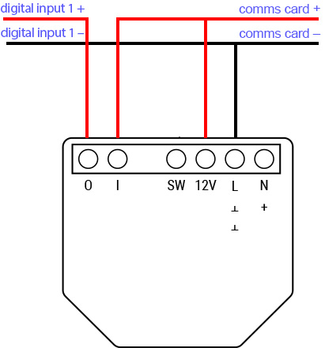
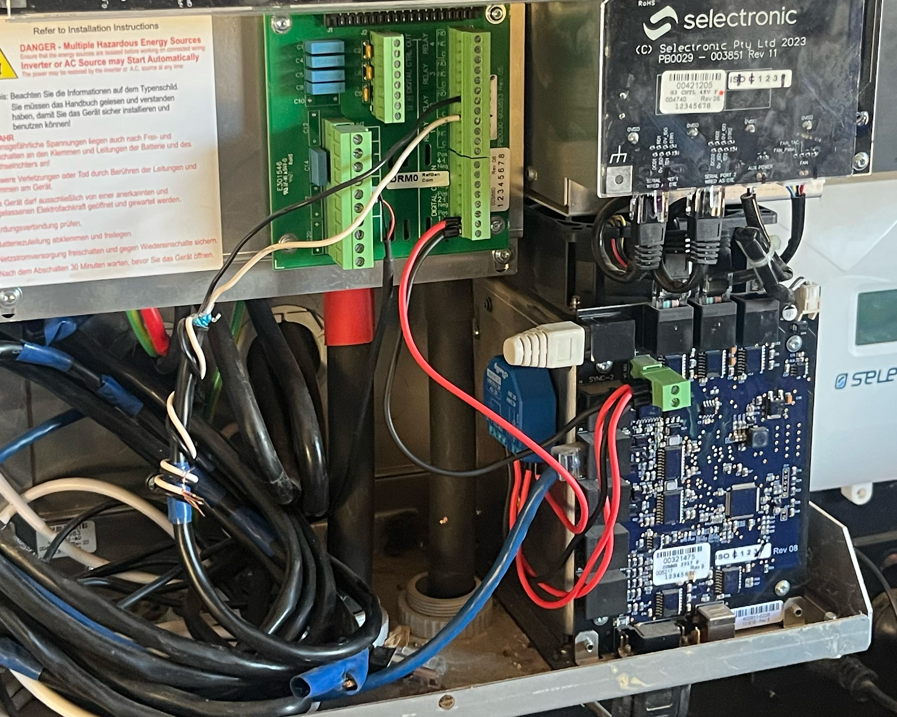

# Introduction

This repository provides instructions for integrating the Selectronic SP Pro Series 2i Sine Wave Interactive Inverter Charger with Home Assistant. It also explains how to configure a Shelly relay switch to remotely wire-start a connected generator.

## Configuration

There is currently no built-in [Add-on](https://www.home-assistant.io/addons/) or custom [HACS](https://www.hacs.xyz/) integration available for Selectronic inverters. However, you can edit your [configuration.yaml](https://www.home-assistant.io/docs/configuration/) file to expose Selectronic attributes as entities in Home Assistant. These entities can then be used on dashboards, in automations, and more.

Refer to [configuration.yaml](configuration.yaml) for a list of available Selectronic attributes and entity configurations.

### Selectronic Data Feed URL

To retrieve data, you need the URL of the local JSON feed from your Selectronic system. The URL follows this format:

```
http://[local_ip]/cgi-bin/solarmonweb/devices/[device_id]/point
```

**Steps to obtain the URL:**

1. Log in to your router to view connected devices on your network and find the IP address assigned to your Select.live device.
2. Open this IP address in your web browser. You should see a page [similar to this](img/select-live.png).
3. Click on the "click here" link on that page. Then, right-click the 8-character device ID in the first column and select **Inspect** (in Chrome; this may differ in other browsers).
4. In the Elements pane, look for an `id` attribute in the `<tr>` element just above the selected `<td>` element. It will be prefixed with `dev-`.
5. Copy the value, remove the `dev-` prefix, and replace `[device_id]` in the URL with this 32-character string.
6. Use this completed URL as the `resource` value in your [configuration.yaml](configuration.yaml) file (where `INSERT_URL_HERE` is indicated).

<kbd>  </kbd><br>_Locating the device id in select.live web interface_

The provided configuration file defines common entities you might want to include on your Home Assistant dashboard or in automations. Other attributes are commented out, but you can uncomment them if needed.

### Off-Grid Configuration Note

The provided [configuration.yaml](configuration.yaml) is tailored for off-grid setups, where the "generator power" entity uses the `grid_w` attribute (since it represents the external power source in off-grid systems).

After editing and saving your YAML file, perform a **quick reload** to make the new entities available in Home Assistant.

## Dashboard Example

Below is an example dashboard created using available Home Assistant cards. You can configure cards to be conditionally visible — for example, showing the generator power gauge only when the generator is running.

<kbd>  </kbd><br>_Example Home Assistant Dashboard_

## Generator Remote Start

The SP Pro Series does not natively support remote start/stop of a connected generator. However, you can achieve this using a smart switch such as the [Shelly 1](https://www.shelly.com/products/shelly-1-gen3), wired to the generator's digital input.

<br>_Wiring diagram for Selectronic digital input_

The communications card provides a 12V power source, which can power the Shelly switch and send a wire-start signal to the generator. Below is the wiring diagram for the Shelly 1 switch.

<br>_Wiring diagram for Selectronic digital input to Shelly switch_

The switch can be surface-mounted inside the chassis using double-sided tape.

<br>_Shelly switch surface-mounted in Selectronic inverter_

> ⚡ **Important:** Installation should be completed by a qualified electrician.

## Shelly Switch Configuration

Most generators require a 12V pulse to start or stop. To achieve this, the switch should turn on briefly and then automatically turn off.

**Configuration steps:**

1. Open the Shelly switch IP address in your web browser.
2. Set the input mode for Input(0) to `Switch` ([see screenshot](img/shelly-input-setting.png)).
3. Configure an action so that when the switch turns on, it automatically sets the Output State to Off ([see screenshot](img/shelly-output-action.png)).

After this setup, when you turn the switch on, it will immediately toggle off, sending a 12V pulse signal to start or stop the generator depending on its current state.

Next, configure the Digital Input in the SP Pro settings. This should be performed by a qualified Selectronic installer, but it can also be done remotely via Configuration Settings > Inputs/Outputs.

Finally, you can add the Shelly switch to your Home Assistant dashboard as a card, as shown in the dashboard example above.