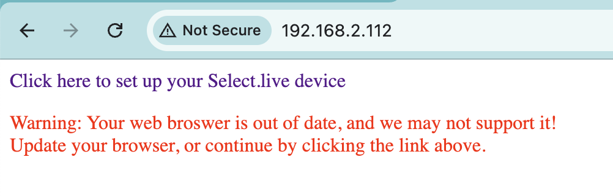

# Introduction
This repository provides details on how to integrate the Selectronic SP Pro Series 2i Sine Wave Interactive Inverter Charger with Home Assistant. Additionally, it describes how to remotely wire start a connected generator using a Shelly relay switch.

## Configuration
While there is not currently a built in [Add-on](https://www.home-assistant.io/addons/) or custom [HACS](https://www.hacs.xyz/) element, you can edit the [configuration.yaml](https://www.home-assistant.io/docs/configuration/) file to expose Selectronic attributes as entities in Home Assistant, which can then be used on dashboards, in automations and more

Refer to [configuration.yaml](configuration.yaml) for available Selectronic attributes in Home Assistant and entity configuration.

### Feed URL

You will need to locate the URL to the local JSON feed of your Selectronic data. The URL is in the following format:

`http://[local_ip]/cgi-bin/solarmonweb/devices/[device_id]/point`

Login to your router to view connected devices on your network and locate the IP address assigned to your Select.live device on your local network. If you open this IP address in your web browser, you should see a page like this:

You will use this ip address in the `[local_ip]` placeholder from the above URL. Next, you need to obtain the device id. Open on the 'click here' link from the previous page and right click on the 8 character device id in the first column and click 'Inspect' (in Chrome, procedure may differ across browsers). In the Elements pane, you will see an `id` attribute value in the `<tr>` element just above the selected `<td>` element prefixed with `dev-`. Copy this value, discard the `dev-` prefix and replace  `[device_id]` in the above URL with this 32 character value. You can now use this as the `resource` value in the YAML file, indicated by the `INSERT_URL_HERE` placeholder. 

This file defined common entities which you may want to include on your Home Assistant dashboard and in automations. Other telemetry attributes have been commented out, but you can uncomment these lines if you would like to view these entities.

### Off-Grid Configuration

The above configuration is for an off-grid setup, which is why the  For some reason, the "generator power" entity uses the `grid_w` attribute (as this is the only external power source). 

You will need to perform a 'quick reload' after saving your YAML file in order for the new entities to become available.

## Dashboard

Here's a dashboard that I created using available cards in Home Assistant. Note you can configure cards to be conditionally visible based on a condition, for example, I only display the 'generator power' gauge if the generator is running.

## Generator Remote Start

The SP Pro Series does not provide a method to remotely start and stop a connected generator. However, you can use a smart switch like the [Shelly 1](https://www.shelly.com/products/shelly-1-gen3) to remotely start the generator by wire start using an available digital input. The following wiring diagram illustrates how to connect a relay or switch to control an external generator.

The communications card provides a 12V power source which can be used to power the  Shelly switch and also send a wire start signal to the generator. The wiring diagram for the Shelly 1 switch is illustrated below.

The switch can be surface mounted to the inside chassy using double-sided mounting tape. 

## Shelly Switch Configuration

Most generators require a 12V pulse to start and stop the generator. As a result, when the switch is turned on, it needs to be turned off momentarily. The easiest method to configure this is to configure an action on the Shelly switch.

